### BCC Video System Diagram

This document provides a visual and text-based diagram of the church's video signal distribution.



Copy and paste code below to [Mermaid Chart Playground](https://www.mermaidchart.com/play) to edit and export as SVG.

```
---
config:
  flowchart:
    htmlLabels: false
  themeVariables:
    primaryColor: '#f4f4f9'
  layout: elk
---
flowchart TD
  subgraph L3_Sanctuary["L3: Sanctuary"]
    VIDEO_WALL["Video Wall"]
    TV_STAGE_MONITOR["Stage Monitor"]
    TV_SANCTUARY["Sanctuary TV"]
  end
  subgraph L3_CryRoom["L3: Cry Room"]
    TV_CRY_ROOM["Cry Room TV"]
  end
  subgraph L2_Rm2A["L2: Room 2A"]
    PROJ_2A["Room 2A Projector"]
  end
  subgraph L2_Rm2B["L2: Room 2B"]
    PROJ_2B["Room 2B Projector"]
  end
  subgraph L1_Rm1A["L1: Room 1A"]
    PROJ_1A["Room 1A Projector"]
  end
  subgraph L1_Lobby["L1: Lobby"]
    TV_LOBBY["Lobby TV"]
  end
  CAM1["CAM1"] -- SDI --> PC_OBS["OBS PC"]
  CAM2["CAM2"] -- SDI (Input 2) --> SWITCHER_ATEM["ATEM SDI switcher"]
  CAM2 -- HDMI --> PC_OBS
  CAM3["CAM3"] -- SDI --> PC_OBS
  CAM4["CAM4"] -- SDI --> PC_OBS
  PC_PROJECTION["Projection PC"] -- HDMI --> SPL_PROJECTION["SPL_PROJECTION"] & VIDEO_WALL
  PC_PROJECTION -- HDMI to SDI to HDMI --> TV_STAGE_MONITOR
  SPL_PROJECTION -- SDI (Input 1) --> SWITCHER_ATEM
  SPL_PROJECTION -- HDMI --> PC_OBS
  PC_OBS -- HDMI to SDI --> DST_OBS_PROGRAM["DST_OBS_PROGRAM"]
  DST_OBS_PROGRAM -- SDI (Input 4) --> SWITCHER_ATEM
  DST_OBS_PROGRAM -- SDI --> DST_L2["DST_L2"]
  DST_OBS_PROGRAM -- SDI to HDMI --> PROJ_1A & TV_LOBBY
  DST_L2 -- SDI to HDMI --> PROJ_2A & PROJ_2B
  SWITCHER_ATEM -- SDI --> DST_ATEM_PROGRAM["DST_ATEM_PROGRAM"]
  DST_ATEM_PROGRAM -- SDI to HDMI --> TV_SANCTUARY & TV_CRY_ROOM
  CAM1:::camera
  CAM2:::camera
  CAM3:::camera
  CAM4:::camera
  PC_OBS:::control
  PC_PROJECTION:::control
  SWITCHER_ATEM:::control
  SPL_PROJECTION:::distribution
  DST_OBS_PROGRAM:::distribution
  DST_ATEM_PROGRAM:::distribution
  DST_L2:::distribution
  classDef camera fill:#b3def6,stroke:#222,stroke-width:2px
  classDef control fill:#ffe5b4,stroke:#222,stroke-width:2px
  classDef distribution fill:#e2d1f9,stroke:#222,stroke-width:2px

```

-----

### **Device and Connection Summary**

This is a breakdown of the devices and signal flow.

  * **Level 3**
      * **Cameras**
          * **CAM1**, **CAM3**, and **CAM4** all output to the **PC\_OBS**.
          * **CAM2** has two outputs: one to **SWITCHER\_ATEM** (Input 2) and another to the **PC\_OBS**.
      * **Control**
          * The **PC\_PROJECTION** outputs its signal to the **SPL\_PROJECTION**, **TV\_STAGE\_MONITOR**, and **VIDEO\_WALL**.
          * The **PC\_OBS** receives its inputs from the **SPL\_PROJECTION** and all four cameras. It outputs its signal to the **DST\_OBS\_PROGRAM**.
          * The **SWITCHER\_ATEM** receives inputs from the **SPL\_PROJECTION** (Input 1), **CAM2** (Input 2), and **DST\_OBS\_PROGRAM** (Input 4). It outputs its program feed to the **SWITCHER\_DST\_ATEM\_PROGRAM**.
      * **Distribution**
          * The **SPL\_PROJECTION** splits the signal from the **PC\_PROJECTION** and sends it to the **SWITCHER\_ATEM** and the **PC\_OBS**.
          * The **DST\_OBS\_PROGRAM** distributes the feed from the **PC\_OBS** to the **SWITCHER\_ATEM** (Input 4), **DST\_L2**, **PROJ\_1A**, and **TV\_LOBBY**.
          * The **DST\_L2** distributes the feed from the **DST\_OBS\_PROGRAM** to the **PROJ\_2A** and **PROJ\_2B**.
          * The **SWITCHER\_DST\_ATEM\_PROGRAM** distributes the program feed from the **SWITCHER\_ATEM** to the **TV\_SANCTUARY** and **TV\_CRY\_ROOM**.
      * **Outputs**
          * The **VIDEO\_WALL** and **TV\_STAGE\_MONITOR** receive their signal directly from the **PC\_PROJECTION**.
          * The **TV\_SANCTUARY** and **TV\_CRY\_ROOM** receive their signal from the **SWITCHER\_DST\_ATEM\_PROGRAM**.
  * **Level 2 & 1**
      * **Outputs**
          * The **PROJ\_2A**, **PROJ\_2B**, **PROJ\_1A**, and **TV\_LOBBY** receive their signal from the **DST\_OBS\_PROGRAM**.